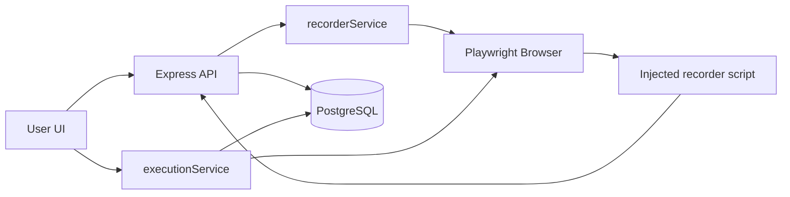

# Project Structure

High-level map of the **Test Sambil Ngopi** monorepo. For file-by-file detail see [`docs/DIRECTORY_STRUCTURE.md`](./docs/DIRECTORY_STRUCTURE.md).

**Last updated:** June 2026 · **Version:** 1.9.x

---

## Repository layout

```
testingndrih/
│
├── backend/                      # Node.js API + Playwright automation
│   ├── src/
│   │   ├── controllers/          # HTTP handlers (auth, scenarios, execution, …)
│   │   ├── services/             # Business logic (33 services)
│   │   ├── routes/               # Express routers mounted at /api/*
│   │   ├── middleware/           # JWT auth, API token auth
│   │   ├── lib/                  # Prisma client, browser launcher, logger
│   │   └── utils/                # JWT, password, roles, image diff
│   ├── prisma/
│   │   ├── schema.prisma         # Database models
│   │   └── migrations/           # SQL migrations
│   ├── scripts/                  # seed, rotate-admin-password, db maintenance
│   ├── tests/                    # Integration & security test suites
│   └── uploads/                  # Screenshots, videos (gitignored)
│
├── frontend/                     # React 18 + Vite SPA
│   ├── src/
│   │   ├── pages/                # Route-level screens (32 pages)
│   │   ├── components/           # Layout, modals, forms, UI primitives
│   │   ├── store/                # Zustand (auth, settings)
│   │   ├── services/             # Axios API client
│   │   ├── hooks/                # Custom React hooks
│   │   ├── constants/            # Welcome splash copy, admin paths
│   │   └── utils/                # Validation, export helpers
│   ├── e2e/                      # Playwright end-to-end specs (17 files)
│   └── public/                   # favicon.svg, maintenance.html
│
├── docs/                         # Documentation (see docs/README.md)
│   ├── ARCHITECTURE.md
│   ├── DIRECTORY_STRUCTURE.md
│   ├── SETUP.md
│   ├── TESTING.md
│   ├── API_ENDPOINTS.md
│   └── DEPLOYMENT.md
│
├── scripts/                      # Root-level ops scripts
│   ├── health-check.js
│   ├── telegram-deploy-notify.sh
│   ├── production-recover.sh
│   ├── maintenance-mode.sh
│   └── setup-github-runner.sh
│
├── deploy/
│   └── nginx/                    # Example reverse-proxy config
│
├── .github/workflows/
│   ├── ci.yml                    # Lint + backend test + platform E2E
│   ├── release.yml               # semantic-release
│   ├── deploy-production.yml     # VPS deploy (self-hosted runner)
│   ├── prod-monitor.yml          # Scheduled live smoke tests
│   ├── post-maintenance-deploy.yml
│   └── ci-run-scenario.example.yml
│
├── docker-compose.yml            # PostgreSQL + app container
├── Dockerfile                    # Multi-stage build (frontend + backend)
├── package.json                  # npm workspaces root
├── README.md                     # Main project readme
└── CHANGELOG.md                  # Auto-generated release notes
```

---

## Backend modules

| Module | Path | Responsibility |
|--------|------|----------------|
| **Auth** | `controllers/authController.js` | Login, register, password reset |
| **Scenarios** | `services/scenarioService.js` | CRUD, duplicate, stats |
| **Test steps** | `services/testStepService.js` | Step CRUD, reorder, batch |
| **Recorder** | `services/recorderService.js` | Playwright recording sessions |
| **Execution** | `services/executionService.js` | Playback, screenshots, cancel |
| **Retry engine** | `services/retryEngineService.js` | Flaky step retries |
| **Chains** | `services/chainService.js` | Multi-scenario workflows |
| **Scheduler** | `services/schedulerService.js` | Cron jobs |
| **Analytics** | `services/analyticsService.js` | Dashboard metrics |
| **Smoke / stress / security** | `*TestService.js` | Specialized test runners |
| **Visual regression** | `visualRegressionService.js` | Baseline & diff |
| **Environments** | `environmentService.js` | Variables & secrets |
| **Users** | `userService.js` | Admin user CRUD |
| **CI** | `controllers/ciController.js` | API token scenario runs |
| **Notifications** | `notificationService.js` | Email / webhook settings |

**Entry point:** `backend/src/server.js` — mounts all `/api/*` routes and serves built frontend in Docker.

---

## Frontend pages (by area)

| Area | Pages |
|------|-------|
| **Auth** | Login, Register, ForgotPassword, ResetPassword |
| **Core** | Dashboard, Scenarios, ScenarioDetail, Execution, Reports, Analytics, Settings |
| **Admin tools** | SmokeTest, StressTest, SecurityTest, ApiTesting, VisualRegression, Environments, Chains, ChainBuilder, ChainExecutor, Scheduler, Parallel, BrowserMatrix |
| **System** | Maintenance, SessionExpired, Forbidden, ServerError, NotFound |
| **Help** | SmokeTestHelp, StressTestHelp, SecurityTestHelp |

**Routing:** `frontend/src/App.jsx` — `ProtectedRoute` + `AdminRoute` for role gating.

---

## Data flow (record → execute)



---

## Configuration files

| File | Purpose |
|------|---------|
| `.env.example` | Docker / full-stack template |
| `backend/.env.example` | Local API development |
| `backend/.env.test.example` | Test database |
| `frontend/playwright.config.js` | E2E browser projects |
| `backend/jest.config.js` | Unit test config |
| `.releaserc.json` | semantic-release rules |
| `commitlint.config.js` | Conventional commit lint |

---

## UI defaults (2026)

- **Theme:** Light (indigo accent `#5E6AD2`)
- **Language:** English UI copy
- **Roles:** `ADMIN` (full tools) · `USER` (core testing)
- **Primary admin:** configured via `ADMIN_EMAIL` in `.env`

---

## Related docs

| Need | Go to |
|------|-------|
| Install locally | [`docs/SETUP.md`](./docs/SETUP.md) |
| Deploy production | [`docs/DEPLOYMENT.md`](./docs/DEPLOYMENT.md) |
| API list | [`docs/API_ENDPOINTS.md`](./docs/API_ENDPOINTS.md) |
| Run tests | [`docs/TESTING.md`](./docs/TESTING.md) |
| Architecture deep-dive | [`docs/ARCHITECTURE.md`](./docs/ARCHITECTURE.md) |
