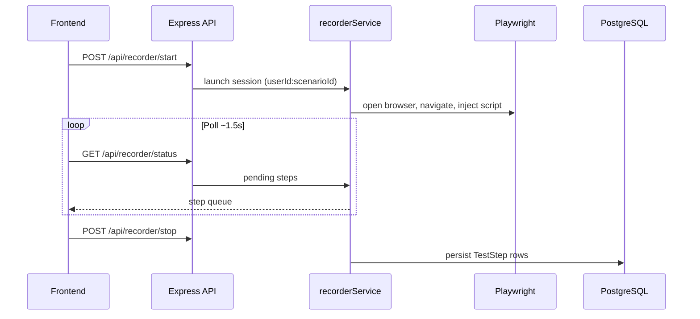

# Architecture Overview

**Test Sambil Ngopi** is an automated testing platform that records browser interactions with Playwright and replays them as reusable test scenarios.

- **Tech stack:** React 18 + Vite + TailwindCSS | Node.js 20 + Express | PostgreSQL 16 + Prisma 7 | Playwright 1.58
- **Architecture:** npm workspaces monorepo (`backend/` + `frontend/`) with optional Docker Compose
- **Production:** [testsambilngopi.com](https://testsambilngopi.com)
- **Status:** Production ready (v1.9.x)

---

## Directory layout

```
testingndrih/
├── backend/              # Express API + Playwright engine
│   └── src/
│       ├── controllers/  # HTTP handlers (21)
│       ├── services/     # Business logic (33)
│       ├── routes/       # REST route definitions
│       ├── middleware/   # JWT + API token auth
│       ├── lib/          # Prisma, browser launcher, logger
│       └── utils/        # JWT, password, roles, image diff
│
├── frontend/             # React SPA
│   └── src/
│       ├── pages/        # 32 route-level screens
│       ├── components/   # Layout, modals, UI
│       ├── store/        # Zustand (auth, settings)
│       ├── services/     # Axios API client
│       └── hooks/        # Custom React hooks
│
├── docs/                 # Documentation
├── scripts/              # Ops: deploy/, notify/, ops/ (see scripts/README.md)
└── .github/workflows/    # CI, release, deploy, monitor
```

Full file map: [DIRECTORY_STRUCTURE.md](./DIRECTORY_STRUCTURE.md) · [PROJECT_STRUCTURE.md](../PROJECT_STRUCTURE.md)

---

## Key technologies

| Layer | Technology | Purpose |
|-------|------------|---------|
| Frontend UI | React 18 + Vite 5 | SPA with HMR |
| Styling | TailwindCSS 3.4 | Light theme, responsive |
| State | Zustand | Auth & settings |
| API client | Axios | HTTP with JWT interceptors |
| Charts | Recharts | Analytics dashboard |
| Backend | Express 4 | REST API on port 5001 |
| Database | PostgreSQL 16 | Persistent storage |
| ORM | Prisma 7 | Migrations & queries |
| Automation | Playwright 1.58 | Record, execute, E2E |
| Auth | JWT + bcrypt | Role-based (ADMIN / USER) |
| Captcha | Cloudflare Turnstile | Login / register / reset |
| Deploy | Docker + GitHub Actions | Self-hosted runner on VPS |

---

## Data flow

```
User (browser)
    ↓ HTTP /api/*
Express routes → controllers → services
    ↓
PostgreSQL (Prisma)          Playwright (recorder / executor)
    ↓
Analytics, reports, issues, notifications
```

1. **Record** — Playwright opens target URL, injected script captures interactions
2. **Store** — Steps saved to PostgreSQL via Prisma
3. **Execute** — `executionService` replays steps with waits, screenshots, retries
4. **Report** — Results feed analytics, issue tracker, PDF/HTML export

---

## Record & playback

### Recording pipeline



**Selector priority:** `data-testid` → `id` → CSS → XPath  
**Key files:** `recorderService.js`, `recorderController.js`, `ScenarioDetailPage.jsx`

### Playback pipeline

1. Client triggers execution (`POST /api/executions`)
2. `executionService` loads scenario steps + environment variables
3. Playwright runs each step (NAVIGATE, CLICK, FILL, ASSERTION, …)
4. On failure: screenshot, locator suggestions, optional retry via `retryEngineService`
5. Execution record stored; webhooks / email on failure if configured

---

## Feature modules

| Module | Backend | Frontend |
|--------|---------|----------|
| **Core** | scenario, testStep, execution, search | Scenarios, ScenarioDetail, Execution |
| **Recording** | recorderService | Record controls on ScenarioDetail |
| **Chains** | chainService | Chains, ChainBuilder, ChainExecutor |
| **Scheduler** | schedulerService | SchedulerPage |
| **Parallel** | parallelExecutionService | ParallelExecutionPage |
| **Browser matrix** | browserMatrixService | BrowserMatrixPage |
| **Smoke / stress / security** | *TestService | Admin tool pages |
| **API testing** | apiTestService | ApiTestingPage |
| **Visual regression** | visualRegressionService | VisualRegressionPage (admin) |
| **Environments** | environmentService | EnvironmentsPage |
| **Analytics** | analyticsService | AnalyticsPage, ReportsPage |
| **Users** | userService, userActivityService | UserManagement (admin) |
| **CI** | ciController, apiTokenService | API tokens in Settings |
| **Auth** | authController | Login, Register, Reset |

---

## Security

- JWT on protected `/api/*` routes (`middleware/auth.js`)
- Role checks: `ADMIN` vs `USER` (`utils/roles.js`, `AdminRoute` on frontend)
- API tokens for CI runs (`middleware/apiTokenAuth.js`)
- bcrypt password hashing
- Turnstile captcha on auth forms
- CORS + input validation
- Secrets only in `.env` — never committed (public repo)

---

## Resilience & maintenance

| Component | Role |
|-----------|------|
| `ServerHealthMonitor.jsx` | Polls `/health`, redirects to `/maintenance` when down |
| `MaintenancePage.jsx` | Auto-retry UI when API unavailable |
| `maintenance.html` | Static fallback when nginx/Docker is down |
| `MAINTENANCE_MODE=true` | Backend returns 503 on `/health` |
| `scripts/deploy/maintenance-mode.sh` | Toggle maintenance on VPS |

---

## CI/CD architecture

| Workflow | Purpose |
|----------|---------|
| `ci.yml` | Lint, backend Jest, platform E2E |
| `release.yml` | semantic-release → git tag |
| `deploy-production.yml` | Deploy to VPS (self-hosted runner) |
| `prod-monitor.yml` | Scheduled live smoke against production |
| `post-maintenance-deploy.yml` | Redeploy once when prod recovers |

Telegram notifications fire on **release deploy** success/failure only (not routine maintenance redeploys).

---

## Performance

- Vite HMR for fast frontend dev
- Lazy-loaded route components
- Prisma query optimization
- Parallel scenario execution
- SVG/Recharts for analytics (no heavy chart bundle on critical path)

---

## Deployment

**Docker Compose:** PostgreSQL + single `app` container (nginx serves frontend, proxies `/api` to Express).

**Environment variables:** see `.env.example` and [SETUP.md](./SETUP.md).

**Production:** GitHub Actions → self-hosted runner → `docker compose` on VPS. See [DEPLOYMENT.md](./DEPLOYMENT.md).

---

**Last updated:** June 2026
